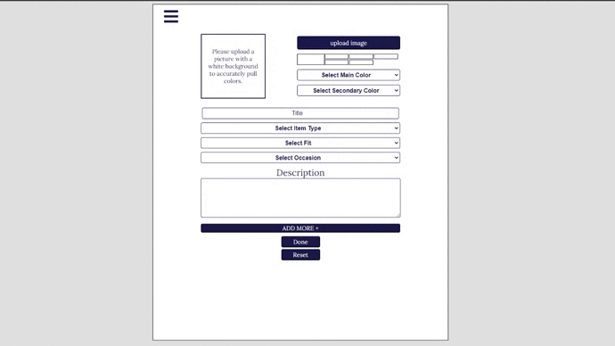

# LAzYdREsSer
## Introduction

["LAzYdREsSer"](http://lazy-dresser.herokuapp.com/) is an application for users to inventory all of their clothes into their account. Ever wake up for work, school, or interview and thought, "What do I have to wear?". This app is supposed to help you create your outfits by pulling your inventory and adding whatever you see fit. If you ever get stuck, the application will also have a randomization button to help you as well.

## Table of Contents

- [Dependencies](#dependencies)
- [Features](#features)
  - [Inventory Clothes](#inventory-clothes)
  - [Create Outfits](#create-outfits)
  - [Randomize Outfit](#randomize-outfit)

## Dependencies

## Features

  - ### Inventory Clothes
    The user will be asked to signup or login to their account before they can inventory their clothes. This feature is to allow the user to organize their current closet into an app. There will be a form for the user to fill out for each item, which are: upload a picture, select 2 colors, add a title, optional description, select the item type, fit type, and occasion. This item upload integrates AWS to efficiently maintain user's images and "Color-Palette" to quickly detect the colors of their item. The user will have the chance to upload more than one item at a time. Once they have uploaded all the items, they will be able to view these items and make any edits or delete the pieces by going to their inventory.

    - Add Items
    

  - ### Create Outfits
    Now that the logged in user has made a full inventory of their closet, they can now see which items will go together. The user will be able to view their list of clothing items and add it to their look. Once they are done, this will be available in their outfit list. The user can also delete their outfit if they don't find it pleasing anymore.

    - Create Outfits
    

  - ### Randomize Outfit
    This feature is to support the user by creating outfits based on what they have in their inventory. For now, the algorithm will match the pieces together based on the color of their items.
