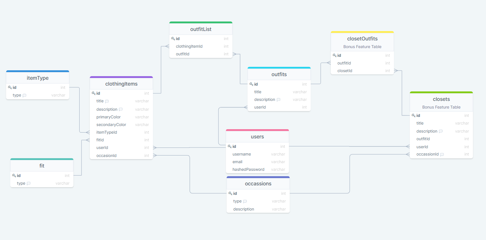
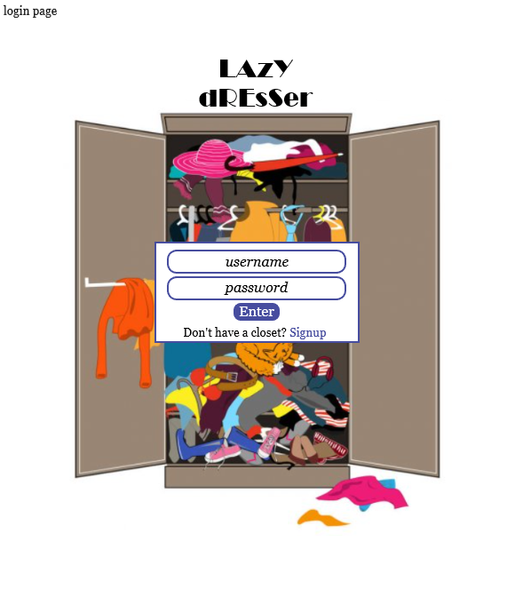
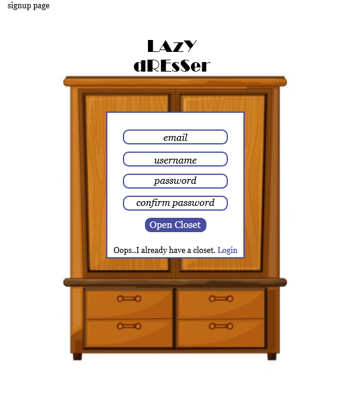
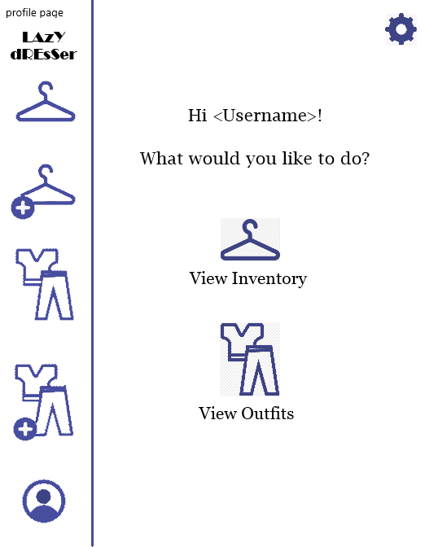
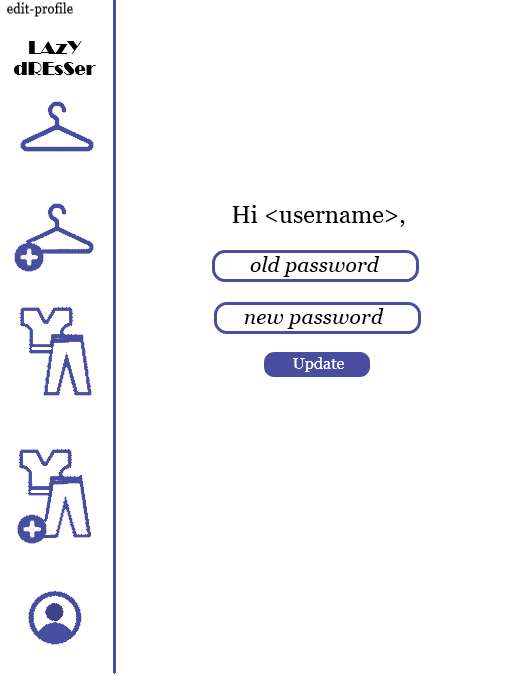
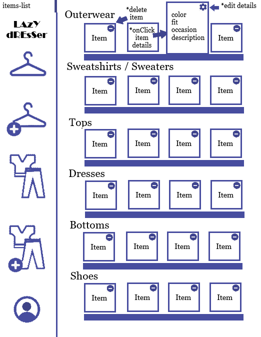
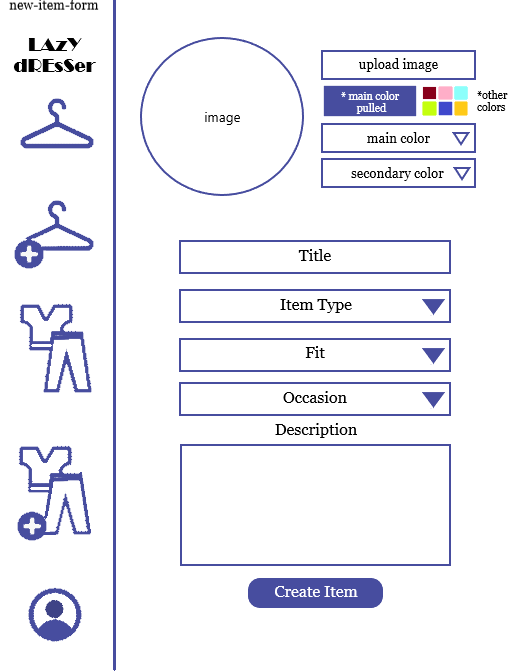
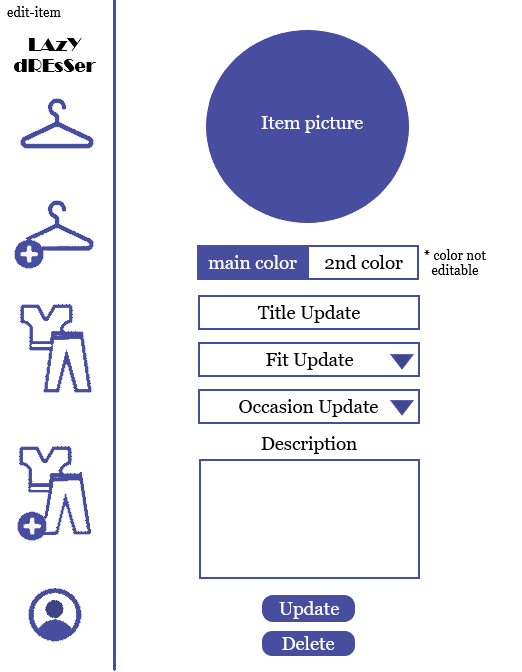
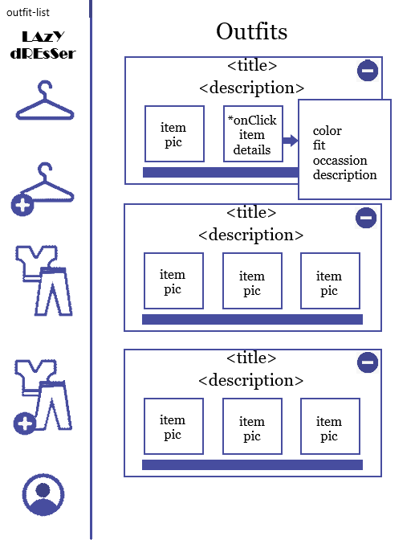

# LAzYdREsSer

## Table of Contents

- [Project Description](#project-description)
- [MVP](#mvp)
- [Bonus Features](#bonus-features)
- [Database Schema and Diagram](#database-schema-and-diagram)
- [Wireframe](#wireframe)
- [Planned Routes](#planned-routes)
- [React Component List](#react-component-list)
- [Planned Technologies](#planned-technologies)

# Project Description

"LAzYdREsSer" is an application built to assist users on their closet inventory. Ever wake up for work, school, or interview and thought, "What do I have to wear?". This app is supposed to help you create your outfits by having a section for all your clothing items. If you ever get stuck, the application will also have a randomization button to help you as well.

Let's take a deeper dive into the different aspects of the application, which will consist of: (1) how the item gets uploaded, (2) what filtering is required, (3) have a location where the user adds he item to create a "look", and (4) how will the randomization algorithm work?

1. How will the user upload their clothing items?
    - My heart is gearing towards AWS for this implementation. However, I would like to do some more research to see if there's any other API that can help with the uploading by taking a picture. With this picture upload, there will be other form fields the user will need to complete. Those items will be color, item type (shirt, pants, dress, etc), fit (loose, tight, or fitted), occasion (daytime, nighttime, casual, dressy), and a description box that will allow them to add any comment on it.

2. What are the filters?
    - This is probably the main bulk of what the application will be about. Based on how the user completed the clothing item, this feature is meant to help them look through their inventory with ease. The user should be able to filter based on the color, item type, fit, and occasion. With the filtering, they can then add the item to their "look"

3. How to create the look?
    - Once the user filters, each item should have an add feature. Once they click on the "+" button, the item will be added into a "new look" location. I would like to have that display show next to their filter so the user can actively see what they're putting together. Once they're satisfied, they can "create the look" and add a title to the item along with a description.
    This "look" will now be in their inventory for future use. (There's nothing wrong with repeating outfits!)

4. Outfit Randomization?
    - This feature is definitely a reach, but I feel like is the most innovative idea I have. It's definitely easy for anyone to create an app that stores an inventory of things. The randomization is supposed to help the user quickly find an outfit based on their needs. This will, for now, start by asking the user what look they're looking for (daytime, night, casual, dressy, business) and filter through their entire inventory. The matching will be based on complementary colors, clothing types (like a shirt needs pants and maybe a jacket whereas a dress just needs a jacket). As time goes on, I would like to advance this randomization algorithm by allowing the user to filter out colors, clothing items, occasion, and style.

# MVP

1. Upload Clothing Item
2. Create Outfit
3. Randomizing Look

# Bonus Features

1. Allow users to update their outfit pieces

2. Allow the user to create "closets" that will pertain all the outfit variations they could want. This closet could be work, party, casual, athletic, etc.

3. Advance the randomization algorithm so it does more than just compare the colors and ensure all the components are there. I would like to have the user be able to filter the randomization based on color, clothing item, style, and occasion.

4. A big stretch that I would love is to integrate outside retail sites into the app to allow users to see how the item they're interested in integrates to their wardrobe.

# Database Schema and Diagram
  [Database Schema Image](https://drawsql.app/app-academy-23/diagrams/lazy-dresser-1)

  

  ## 1. Users
  | Column | Type | Details |
  |--------|------|---------|
  |id      |serial|PK       |
  |username|string(50)|not null|
  |email|string(255)|not null|
  |hashedPassword|binary|not null|

  - One-to-many relationship association with "ClothingItems" table
  - One-to-many relationship association with "Outfits" table
  - One-to-many relationship association with "Closets" table

  ## 2. ItemTypes
  | Column | Type | Details |
  |--------|------|---------|
  |id      |serial|PK       |
  |type|string(50)|not null|

  - One-to-many relationship association with "ClothingItems" table

  ## 3. Fits
  | Column | Type | Details |
  |--------|------|---------|
  |id      |serial|PK       |
  |type|string(50)|not null|

  - One-to-many relationship association with "ClothingItems" table

  ## 4. Occasions
  | Column | Type | Details |
  |--------|------|---------|
  |id      |serial|PK       |
  |type|string(50)|not null|
  |description|string(1000)| |

  - One-to-many relationship association with "ClothingItems" table

  ## 4. ClothingItems
  | Column | Type | Details |
  |--------|------|---------|
  |id      |serial|PK       |
  |title|string(150)|not null|
  |description|string(1000)| |
  |primaryColor|string(50)|not null|
  |secondaryColor|string(50)|not null|
  |itemTypeId|int|not null, FK ("ItemTypes")|
  |fitId|int|not null, FK ("Fits")|
  |userId|int|not null, FK ("Users")|
  |occasionId|int|not null, FK ("Occasions")|

  - One-to-many relationship association with "Users" table
  - One-to-many relationship association with "ItemTypes" table
  - One-to-many relationship association with "Fits" table
  - One-to-many relationship association with "Occasions" table
  - Many-to-many relationship association with "Outfits" table through "OutfitList"

  ## 5. Outfits
  | Column | Type | Details |
  |--------|------|---------|
  |id      |serial|PK       |
  |title|string(150)|not null|
  |description|string(1000)| |
  |userId|int|not null, FK ("Users")|

  - One-to-many relationship association with "Users" table
  - Many-to-many relationship association with "ClothingItems" table through "OutfitList"
  - Many-to-many relationship association with "Closets" table through "ClosetOutfits"

  ## 6. OutfitList
  | Column | Type | Details |
  |--------|------|---------|
  |id      |serial|PK       |
  |clothingItemId|int|not null, FK ("ClothingItems")|
  |outfitId|int|not null, FK ("Outfits")|

  ## 7. Closets (Bonus Feature Table)
  | Column | Type | Details |
  |--------|------|---------|
  |id      |serial|PK       |
  |title|string(150)|not null|
  |description|string(1000)| |
  |outfitId|int|not null, FK ("Outfits")|
  |occasionId|int|not null, FK ("Occasions")|
  |userId|int|not null, FK ("Users")|

  - One-to-many relationship association with "Users" table
  - One-to-many relationship association with "Occasions" table
  - Many-to-many relationship association with "Outfits" table through "ClosetOutfits"

## 8. OutfitList (Bonus Feature Table)
| Column | Type | Details |
|--------|------|---------|
|id      |serial|PK       |
|closetId|int|not null, FK ("Closets")|
|outfitId|int|not null, FK ("Outfits")|

# Wireframe

  
  
  
  
  
  
  
  
  

# Planned Routes

  1. / - landing page once logged in
  2. /login
  3. /signup
  4. /outfit - a list of all their outfits
  5. /items - a list of all their clothing items
  6. /item/create - to create item for their inventory
  7. /item/:id/edit - to edit details about their
  8. /profile/edit

# React Component List

  1. Login
  2. SignUp
  3. CreateItemForm
  4. ItemList
  5. OutfitList
  6. SingleOutfit
  7. CreateOutfitForm
  8. ItemDescription
  9. EditItem
  10. UpdateInformationForm
  11. ProfilePage
  12. Sidebar/Navbar

# Planned Technologies

  1. Express
  2. React
  3. Heroku
  4. [React Palette](https://www.npmjs.com/package/react-palette)
  5. AWS
